# 架构图 Mermaid 代码

## 1. 整体架构图（第5页使用）

展示插件与 Velox 核心的关系，以及组件层次结构。

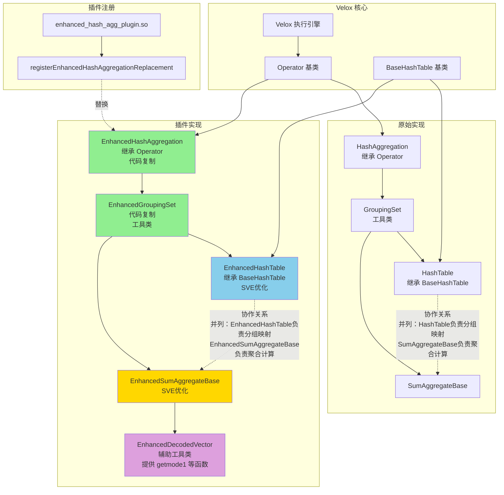

---

## 2. 调用链图（第8页使用）

展示从 HashAggregation 到 HashTable 的调用链，以及 private 变量的关系。

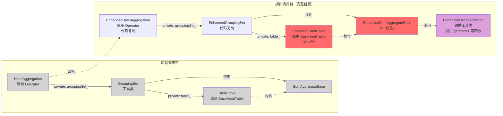

---

## 3. 类继承关系图（第12页使用）

展示 Enhanced 类与原始类的继承关系，以及 Velox 的设计模式。

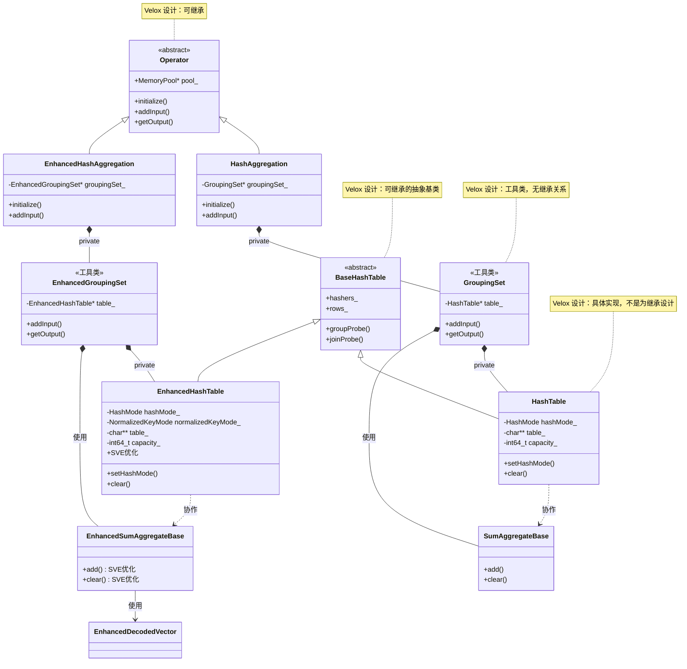

---

## 4. 内存池关系图（第7页使用）

展示内存池的命名和关系，说明如何避免冲突。

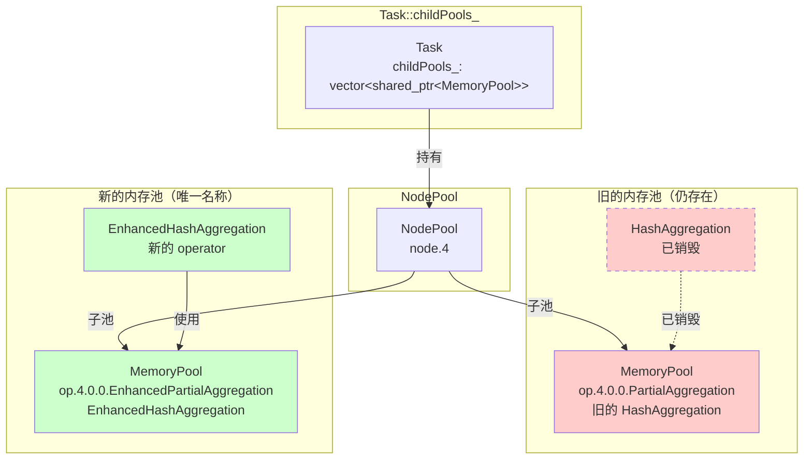

---

## 5. 插件替换流程时序图（第6页使用）

展示插件注册和替换的完整流程。

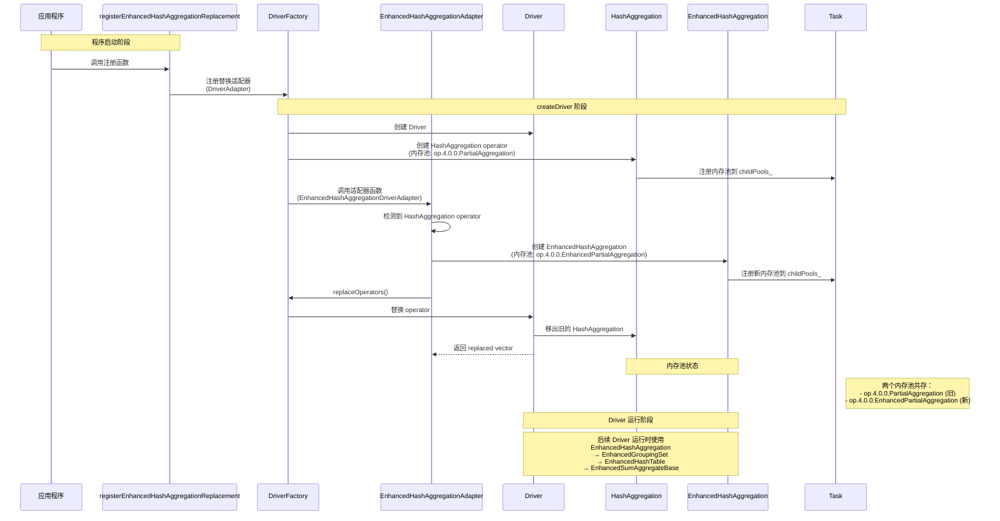

---

## 6. 设计演进对比图（第12页使用）

展示 EnhancedHashTable 的设计演进过程。

```mermaid
graph TB
    subgraph "方案1：继承 HashTable（不可行）"
        S1[EnhancedHashTable<br/>: public HashTable]
        S1_Problem[问题：<br/>- virtual 函数需修改 HashTable private 变量<br/>- 无法访问 private 成员<br/>- HashTable 不是为继承设计的]
        S1 --> S1_Problem
        S1_Problem -->|❌| Reject1[不可行]
    end
    
    subgraph "方案2：继承 BaseHashTable（可行）"
        S2[EnhancedHashTable<br/>: public BaseHashTable]
        S2_Advantage[优势：<br/>- BaseHashTable 设计为可继承<br/>- 无 private 变量<br/>- 完全控制状态<br/>- 符合 Velox 设计意图]
        S2 --> S2_Advantage
        S2_Advantage -->|✅| Accept[最终方案]
    end
    
    subgraph "方案3：修改基类（不可行）"
        S3[修改 Velox 核心代码]
        S3_Problem[问题：<br/>- 需要修改外部库<br/>- 破坏插件独立性]
        S3 --> S3_Problem
        S3_Problem -->|❌| Reject2[不可行]
    end
    
    style S1 fill:#FFCCCC
    style S1_Problem fill:#FFCCCC
    style Reject1 fill:#FFCCCC
    style S2 fill:#CCFFCC
    style S2_Advantage fill:#CCFFCC
    style Accept fill:#CCFFCC
    style S3 fill:#FFCCCC
    style S3_Problem fill:#FFCCCC
    style Reject2 fill:#FFCCCC
```

---

## 7. 组件依赖关系图（第11页使用）

展示插件内部组件的依赖关系。

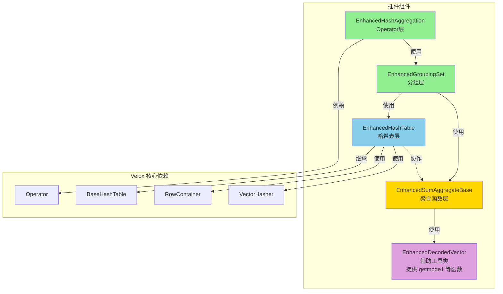

---

## 8. 优化点分布图（第10页使用）

展示 SVE 优化在哪些组件中实现。

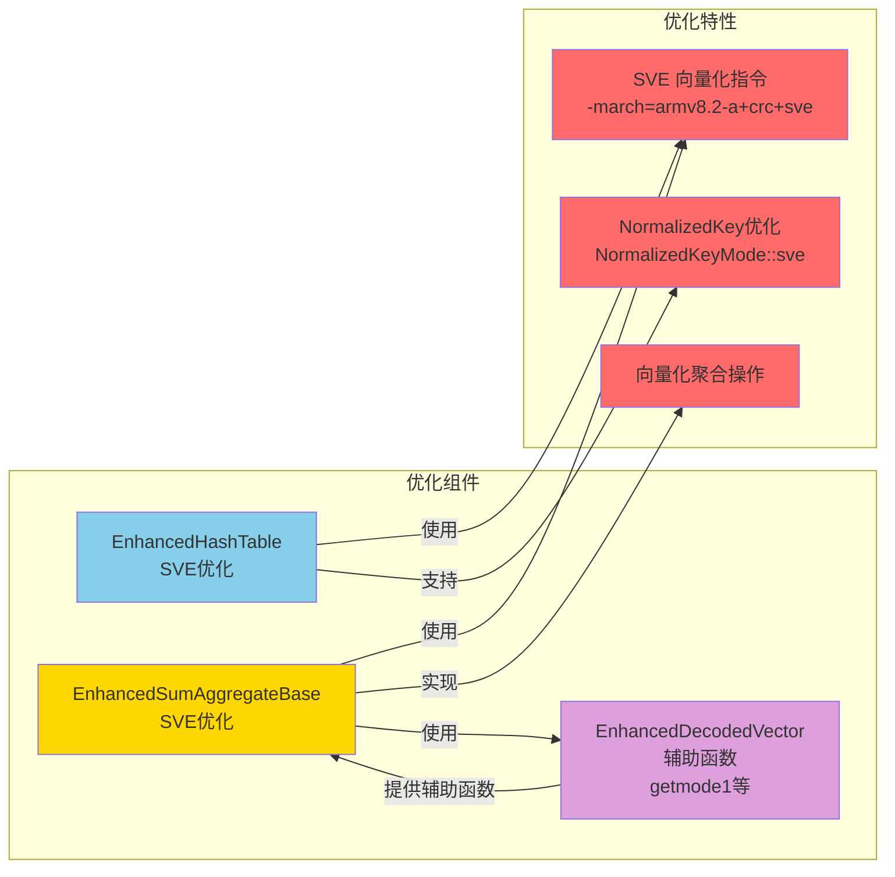

---

## 9. Aggregate 函数流转图 - 简化版（新增）

展示 Aggregate 函数从 PlanNode 到聚合计算的完整流转过程（简化版，通用流程，不涉及插件替换）。

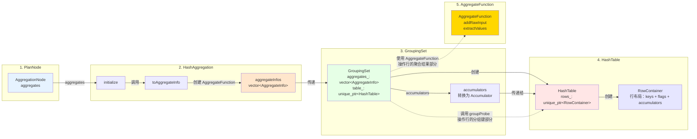

---

## 9-1. Aggregate 函数流转图 - 完整版（新增）

展示 Aggregate 函数从 PlanNode 到聚合计算的完整流转过程，以及插件中各组件的替换关系（完整版，展示所有替换）。

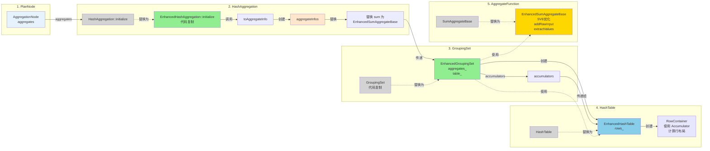

---

## 10. HashTable 与 Aggregate 协作关系图（新增）

展示 HashTable 和 AggregateFunction 的协作关系，说明它们不是上下层关系，而是并列协作。

**协作关系（并列）的含义**：
- `HashTable` 和 `AggregateFunction` 都是被 `GroupingSet` 使用的组件
- 它们功能不同，职责分离，操作不同的对象：
  - `HashTable`：负责**分组映射**（**通过 `groupProbe` 计算哪个输入行属于哪个分组**）
    * **操作两个对象**：
      1. **哈希表本身**：通过 `firstProbe` 和 `fullProbe` 在哈希表中查找或插入
      2. **RowContainer 聚合行**：当找到新分组时，调用 `rows_->newRow()` 创建新行，这些行包含分组键（行的前半部分）
    * **返回结果**：`lookup.hits`（`char*` 数组），包含 RowContainer 中行的指针
  - `AggregateFunction`：负责**聚合计算**（**通过 `addRawInput`/`updateGroups` 更新每个分组的聚合数据**）
    * **操作对象**：RowContainer 中行的**聚合结果部分**（accumulators，行的后半部分）
    * `addRawInput` 接收 `groups`（`char**`），即 `lookup.hits.data()`（由 `groupProbe` 返回）
    * 根据 `offset` 定位到每行的 accumulator 区域并更新
- 它们不是继承关系（不是 HashTable 包含 AggregateFunction）
- 它们并列存在，协作完成聚合任务

**Aggregate 流转路径**：
1. `AggregationNode` → `HashAggregation`（通过 `toAggregateInfo` 转换）
2. `HashAggregation` → `GroupingSet`（传递 `AggregateInfo`）
3. `GroupingSet` → `HashTable` → `RowContainer`（通过 `accumulators` 传递 `Accumulator`）
   - `RowContainer` 使用 `Accumulator` 信息计算行的内存布局：
     * `accumulator.fixedWidthSize()`：计算每个 accumulator 的内存大小
     * `accumulator.alignment()`：计算对齐要求
     * `accumulator.isFixedSize()`：判断是否是固定大小
     * `accumulator.usesExternalMemory()`：判断是否需要外部内存
   - 为每个 accumulator 设置 null flag 和 initialized flag（每个 2 bits）
   - 计算每个 accumulator 在行中的偏移量（offset）
   - 处理 spill（`extractForSpill`）和清理（`destroy`）
4. `GroupingSet` 直接使用 `AggregateFunction` 进行聚合计算

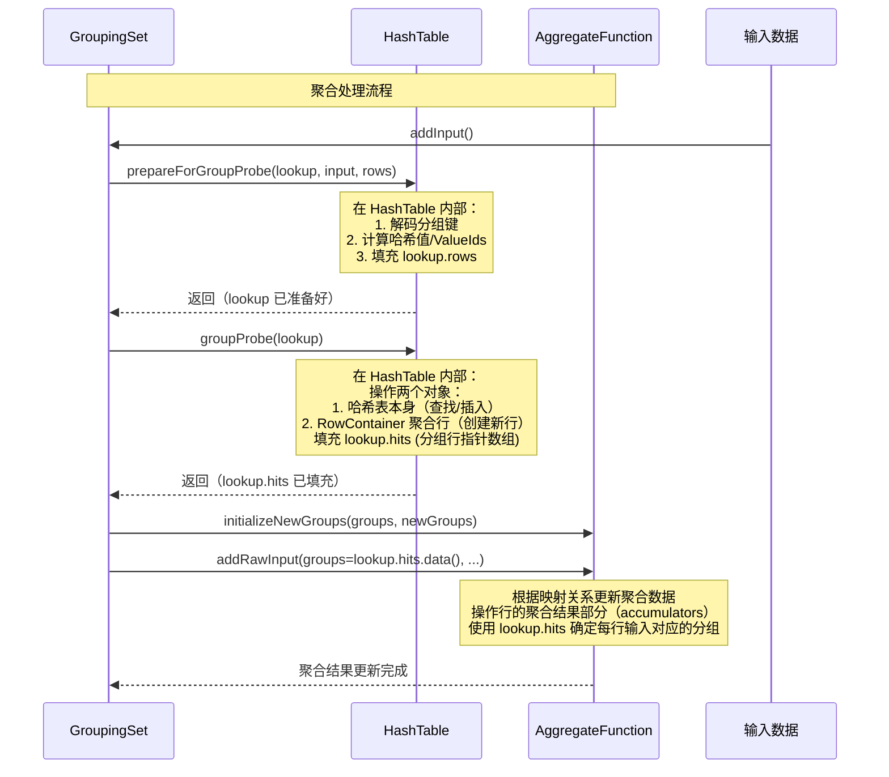

## 使用说明

1. **整体架构图**：用于第5页，展示插件与 Velox 核心的关系
2. **调用链图**：用于第8页，说明为什么需要完整替换调用链
3. **类继承关系图**：用于第12页，展示设计决策和 Velox 设计模式
4. **内存池关系图**：用于第7页，说明内存池冲突解决方案
5. **插件替换流程时序图**：用于第6页，展示替换过程
6. **设计演进对比图**：用于第12页，说明设计决策的演进
7. **组件依赖关系图**：用于第11页，展示代码组织
8. **优化点分布图**：用于第10页，展示 SVE 优化特性
9. **Aggregate 函数流转图 - 简化版**：用于第9页，展示 Aggregate 从 PlanNode 到聚合计算的完整流转（简化版）
9-1. **Aggregate 函数流转图 - 完整版**：用于第9页，展示所有组件的替换关系（完整版）
10. **HashTable 与 Aggregate 协作关系图**：用于第9页，说明 HashTable 和 AggregateFunction 的协作关系

## 在 PPT 中使用

1. 复制对应的 Mermaid 代码
2. 在支持 Mermaid 的工具中渲染（如：
   - [Mermaid Live Editor](https://mermaid.live/)
   - VS Code with Mermaid extension
   - PowerPoint with Mermaid add-in
   - 或导出为图片后插入 PPT）

## 自定义样式

如果需要调整颜色或样式，可以修改：
- `fill:#颜色代码` - 填充颜色
- `stroke:#颜色代码` - 边框颜色
- `stroke-dasharray` - 虚线样式

